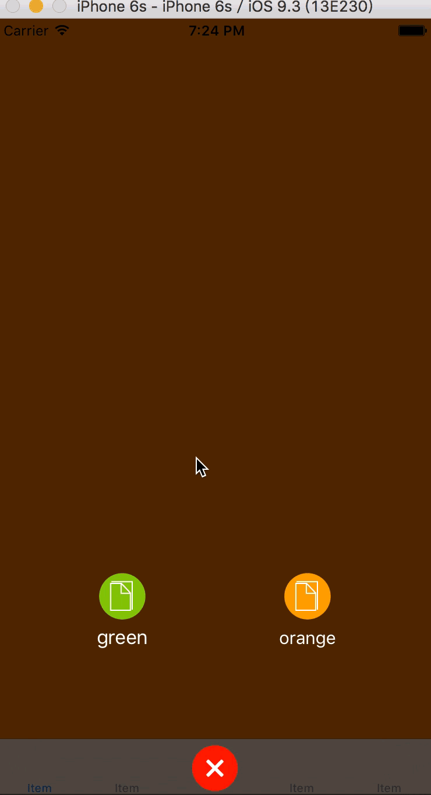

# ALOptionsButton
用于在UITabbar中间添加一个可弹出菜单的button。

## 示例

## 用法

```objective-c
//初始化并添加到tabbar中间
ALOptionsButton *button = [[ALOptionsButton alloc] initForTabBar:self.tabBar forItemIndex:2 delegate:self];
button.backgroundColor = [UIColor redColor];
```

## #ALOptionsButtonDelegate

弹出菜单中的按钮数量，推荐3-4个
```objective-c
- (NSUInteger)alOptionsButtonNumberOfItems:(ALOptionsButton *)alOptionsButton;
```

返回菜单项，类似于`cellforRowAtIndexPath`
```objective-c
- (ALOptionsItem *)tabBar:(UITabBar *)tabBar itemAtIndex:(NSUInteger)index;
```
点击菜单项的回调
```objective-c
- (void)alOptionsButton:(ALOptionsButton *)alOptionsButton didSlectItem:(ALOptionsItem *)item;
```
